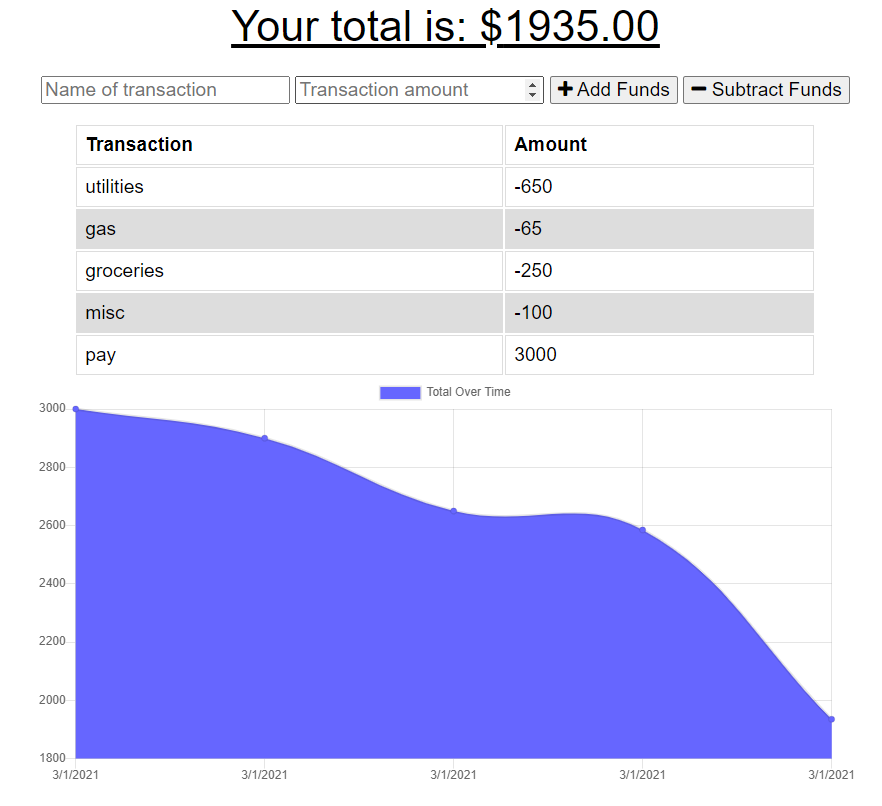

# Budget Tracker

## Description 
A simple online/offline application that can be used to track deposits and payments whether the user is connected to the internet or not with the help of service worker. When offline, entries are stored in IndexedDB and then uploaded to the database (MongoDB Atlas) when reconnected. Additionally, all data can be found in Cache Storage. 

## Links 
Published site: https://track-your-budget-2000.herokuapp.com/ 

## Table of Contents

* [Description](#Description) 
* [Links](#Links)
* [Installation](#Installation)
* [Usage](#Usage)
* [Credits](#Credits)
* [License](#License)
* [Badges](#Badges)

## Installation
Express
Mongoose
Compression
Lite-server
Bootstrap
## Usage

 
 

## Credits
N/A

## License
The Unlicense

## Badges
N/A

## Contributing

I would like to welcome you to work with me on improving this project. Feel free to contact me on gitHub or submit a pull request.

Please note that this project is released with a Contributor Code of Conduct. 
By participating in this project you agree to abide by its terms. 

If you are interested in collaborating with me on this project, please visit (https://www.contributor-covenant.org/version/2/0/code_of_conduct/) to review the latest version of Contributor Covenant. In Node.js, please run the following command "npm install -g covgen" and "covgen '<your_email_address>'". If you have npm 5.x installed you can run npx covgen <your_email_address> instead of installing globally.